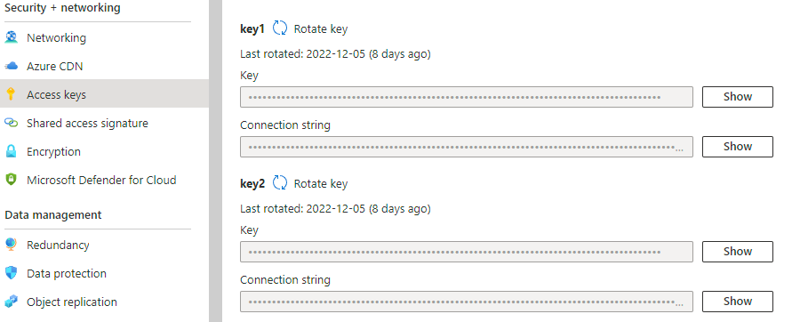

# Azure Function

## About
This repository holds the code for the Azure Function in the [moisture sensor solution](https://github.com/FunkMasterPh/MoistureSensorSolution).

When triggered the function makes a HTTP request to SMHI:s API and gets percipitation data about the Stockholm area. It stores the returned data in a container on an Azure Storage Account where it can be fetched from Power BI to be visualized.

## Get Started
To get started you need to have created a Function App and a Storage Account with a container on your Azure account. You will also need the latest version of Visual Studio [found here.](https://visualstudio.microsoft.com/downloads/)

When everything is configured and installed open Visual Studio and choose "Clone Repository" and then enter the URL to this repository. Now you need to tell the function where to store the data it receives by getting you Storage Account Connection String. This key can be found under "Access Keys" in the left panel when accessing your Storage Account in the Azure Portal.

Copy the first connection string and then open "local.settings.json" and post the string into the "AzureWebJobsStorage" variable. Then you need to enter the name you gave your container in the variable below called "ContainerName".

Now the function can store the data it receives from its API call. 

If you want to change API endpoint just change the URL in the "url" variable in the code. 

Now to publish the function to Azure all you need to do is right click the project in the Solution Explorer and choose Publish.
Official Microsoft documentation for creating and publishing Azure Functions can be found [here.](https://learn.microsoft.com/en-us/azure/azure-functions/functions-develop-vs?tabs=in-process)